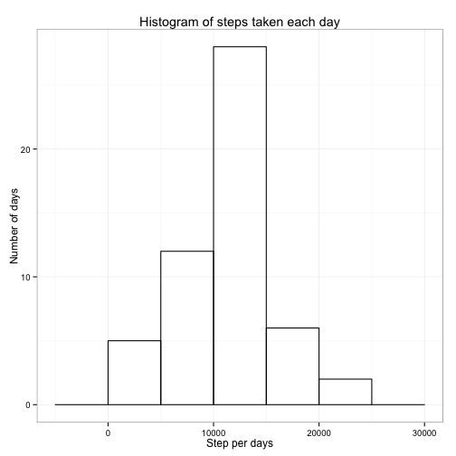
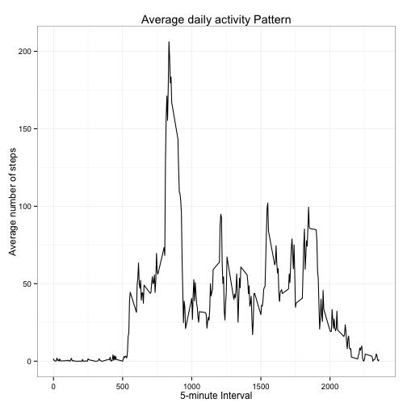
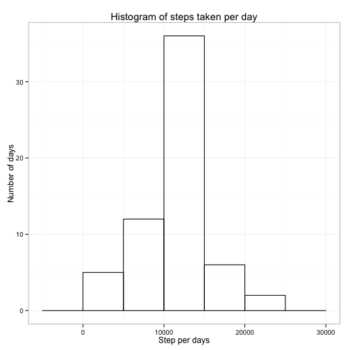
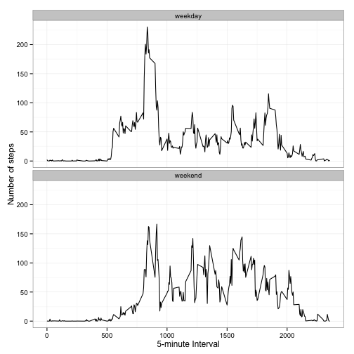

## Before we start

```r
# Loads knitr and ggplot2 libraries
library(knitr)
library(ggplot2)

# set global options
opts_chunk$set(echo=TRUE)

# To ensure English locale is used for Date/Time
Sys.setlocale(category="LC_TIME", locale="C")
```

```
## [1] "C"
```


## Loading and preprocessing the data
1. Unzip and load the activity data

```r
unzip("activity.zip")
activity <- read.csv("activity.csv", na.strings="NA", stringsAsFactors=FALSE )
```

2. Process/transform the data

```r
activity$date <- as.Date(activity$date)
```


## What is mean total number of steps taken per day?

1. The following code makes a histogram of the total number of steps taken each day

```r
stepsPerDay <- aggregate(steps ~ date, activity, sum)
ggplot( stepsPerDay, aes ( steps) ) +
        geom_histogram(fill = NA, color="black", binwidth=5000) + 
        labs(title="Histogram of steps taken each day", 
             x = "Step per days", y = "Number of days") + 
        theme_bw()
```

 

2.The following code calculates the mean and median total number of steps taken per day

```r
mean(stepsPerDay$steps, na.rm=TRUE)
```

```
## [1] 10766.19
```

```r
median(stepsPerDay$steps, na.rm=TRUE)
```

```
## [1] 10765
```

## What is the average daily activity pattern?

1. The following code makes  a time series plot of the 5-minute interval (x-axis) and the average number of steps taken, averaged across all days (y-axis)

```r
stepsPerInterval <- aggregate(steps ~ interval,  activity, mean)
ggplot(stepsPerInterval, aes(interval, steps)) + 
        geom_line() + 
        labs(title="Average daily activity Pattern", 
             x="5-minute Interval", y="Average number of steps") +  
        theme_bw()
```

 

2. The following code answers which 5-minute interval, on average across all the days in the dataset, contains the maximum number of steps?


```r
stepsPerInterval$interval[which.max(stepsPerInterval$steps)]
```

```
## [1] 835
```

## Imputing missing values

1. The following code calculates and reports the total number of missing values in the dataset


```r
sum(is.na(activity))
```

```
## [1] 2304
```

2. and then fills all missing values in the dataset using the mean of 5-min interval previously calculated  

```r
activity2 <- merge(activity, stepsPerInterval, by = "interval", suffixes = c("",".y"))
nas <- is.na(activity2$steps)
activity2$steps[nas] <- activity2$steps.y[nas]
```
3. and then creates a new dataset that is equal to the original dataset but with the missing data filled in.

```r
activity2 <- activity2[, c(1:3)]
```

4. and makes a histogram of the total number of steps taken each day

```r
stepsPerDay2 <- aggregate(steps ~ date,  activity2,  sum)
ggplot( stepsPerDay2, aes ( steps) ) +
        geom_histogram(fill = NA, color="black", binwidth=5000) + 
        labs(title="Histogram of steps taken per day", x = "Step per days", y = "Number of days") + 
        theme_bw()
```

 

5. and finally, calculates and reports the mean and median total number of steps taken per day


```r
mean(stepsPerDay2$steps, na.rm=TRUE)
```

```
## [1] 10766.19
```

```r
median(stepsPerDay2$steps, na.rm=TRUE)
```

```
## [1] 10766.19
```

These values do not differ significantly from the ones calculated in the previous section:


```r
mean(stepsPerDay$steps, na.rm=TRUE)
```

```
## [1] 10766.19
```

```r
median(stepsPerDay$steps, na.rm=TRUE)
```

```
## [1] 10765
```


## Are there differences in activity patterns between weekdays and weekends?

1. The followign code creates a new factor variable in the dataset with two levels -- "weekday" and "weekend" indicating whether a given date is a weekday or weekend day.


```r
daytype <- function(date) {
        if ( weekdays(date) %in% c("Saturday", "Sunday")) {
                "weekend"
        } else {
                "weekday"
        }
}
activity2$daytype <- as.factor(sapply(activity2$date, daytype))
```

2. The following code Makes a panel plot containing a time series plot of the 5-minute interval (x-axis) and the average number of steps taken, averaged across all weekday days or weekend days (y-axis). 


```r
stepsPerDay2 <- aggregate(steps ~ interval+daytype,  activity2, mean)
ggplot(stepsPerDay2, aes(interval, steps)) + 
        geom_line() + 
        facet_wrap(~ daytype, nrow=2, ncol=1) +
        labs(x="5-minute Interval", y="Number of steps") +
        theme_bw()
```

 
